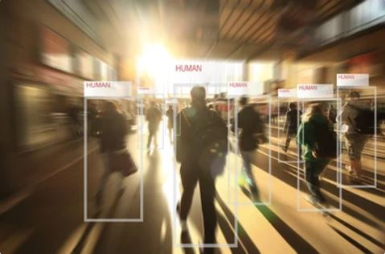

# People detection


## Summary

<p>This application allow to detect people by camera in realtime. It's based on pretrain model ssdlite320_mobilenet_v3_large. If a human gets into the lens of the tracking camera while the application is running, then the area in which the human is located bounded by a rectangle (bounding box) is displayed on the screen. At the same time, information about the date, time and number of detected people is entered into the database. This application should be considered more as a simple application for practicing skills with opencv and pytorch libraries. At the same time, it can be adapted to a more complex task. </p><br>


## Contents

* [Introduction](README.md#Introduction)
* [Project structure](README.md#Project-structure)
* [Installation](README.md#Installation)
* [Activation the virtual environment](README.md#Activation-env)
* [Inference](README.md#Inference)
* [Creation exe](README.md#Creation-exe)
* [Conclusions](README.md#Conclusions) <br><br>


## Introduction
<p>
Detecting people is a basic task of computer vision, since it's associated with a wide range of tasks and automation processes. For example, detection of people in video surveillance systems for the protection of objects, analysis of the occupancy of public space, control of safety at industrial enterprises, study of supply and demand, etc. This application can be adapted to count the number of cars in the parking lot or a certain type of product on the shelves and will be useful for optimizing simple business tasks or research.<br>

<p align="center">
  
  </p>


## Project structure

<details>
<summary>Display project structure </summary> <br>

```Python
car_clf  
├── .gitignore  
├── .venv  
│   └── ...  
├── config  
│   └── data_config.json    ## congiguration file  
├── logs                    ## folder for saving database  
│   └── ...                 
├── utils                   ## folder for utils apps  
│   ├── __ init __.py  
│   ├── camera_acc.py  
│   ├── load_model.py  
│   ├── read_config.py   
│   ├── write_db.py         
├── main.py  
├── readme.md  
└── requirements.txt  
```

</details>


## Installation

<details>
<summary> Display how to install app </summary> <br>

<p> This section provides a sequence of steps for installing and launching the application. <br>

```Python
# 1. Clone repository
git clone https://github.com/ostrebko/people_detection.git

# 2. Go to the new directory:
cd people_detection

# 3. Activate the virtual environment in which you plan to launch the application (we will use VsCode)

# 4. Install requirements:
pip install -r requirements.txt

# 5.Launch app with main.py.
python main.py
```

</details>


## Activation env

<details>
<summary>Display how to create venv </summary> <br>

```Python
# Steps to activate the virtual environment in which you plan to launch the application in VsCode:
# 1. Run VS Code as an administrator, go to the project directory in PowerShell, execute the code below, the env folder containing the virtual environment files will appear
python -m venv .venv

# or you may tap -> Ctrl+Shift+P , then press -> Python: Select Interpreter (we use venv), choose 'Python 3.хх.хх ... Global' for create the virtual environment with GUI of VS Code.

# 2. To change the policy, in PowerShell type
Set-ExecutionPolicy -ExecutionPolicy RemoteSigned -Scope CurrentUser

# 3. Enter the environment folder (env), run the command
.venv/Scripts/Activate.ps1

# 4. An environment marker (env) will appear at the beginning of the line in PowerShell, but VS Code may still not know anything about it. Press Ctrl+Shift+P, type Python: Select Interpreter
# Specify the desired path to python.exe in the env environment folder, this will be displayed at the bottom of the status bar. Now you can install modules only for a specific project.

# 5. If you need to exit press ESC, then execute deactivate in PowerShell, and return to global in the interpreter selection.
```

</details>


## Inference

<details>
<summary>General description </summary> <br>

<p>The term inference in this project means proving the detection of people in realtime with displaing on the screen results of detections (bounding boxes) and writing data of detection in database.</p>  

<p>To carry out an inference perform in the terminal:</p>

```Python
python main.py
```

<p>To stop working the program - press ESC.</p>

</details>


## Creation exe
<details>
<summary> Display how to create exe-file  </summary> <br>

<p>Creating executable .exe file to run the application may be necessary in some cases. For example, if Docker and/or Python are not installed on the computer, the user does not have the minimum skills to install and configure the necessary programs and libraries, or it is impossible to prepare the computer accordingly beforehand (when demonstrating the program on the Director's or Customer's computer).<br>
<p>To create executable .exe file we will use: <a href="www.pyinstaller.org">PyInstaller</a> and the convenient GUI add-in <a href="https://pypi.org/project/auto-py-to-exe/">auto-py-to-exe</a>.<br>

 <p>To create executable .exe file type in the console:

```Python
# 1. Go to the project application and аctivate the virtual environment
# (see section Introduction)

# 2. Install the PyInstaller package
pip install pyinstaller

# 3. Install the auto-py-to-exe package
pip install auto-py-to-exe

# 4. Run the auto-py-to-exe installed app
auto-py-to-exe 

# 5. In the auto-py-to-exe console window select the parameters: 
# 5.1 Script Location: Specify the full path to the file main.py
# 5.2 Onefile (--onedir / --onefile): onefile
# 5.3 Console Window (--console / --windowed) (to see the work of program): Console Based 
# 5.4 In Advanced --hidden-import add (set plus one time and add the following lib): 1. cv2
# 5.5 Settings (auto-py-to-exe Specific Options): Specify the full path to the directory of main.py
# 5.6 The other parameters leave unchanged.

# 6. You can only use the pyinstaller package without installing auto-pytoexe.
# To do this, after step 2 in the command line, 
# specifying the correct path to the project "C:/Full/Path/to/main.py ", run:
pyinstaller --noconfirm --onefile --console --hidden-import "cv2" "C:/Full/Path/to/main.py"
```
</details>


## Conclusions

<p>Conclusions ...  -  should be finalized</p>  

<p>To improve the app, you can try the following:</p>

1. Capturing facial features with a camera.  
2. Load a trained (fine-tunning) model for face processing in the "friend-foe" system.  
3. Making detection with the difference of people and/or repeated passage.  
4. Creating a client-server system or a bot that sends a message after fixing a human.
